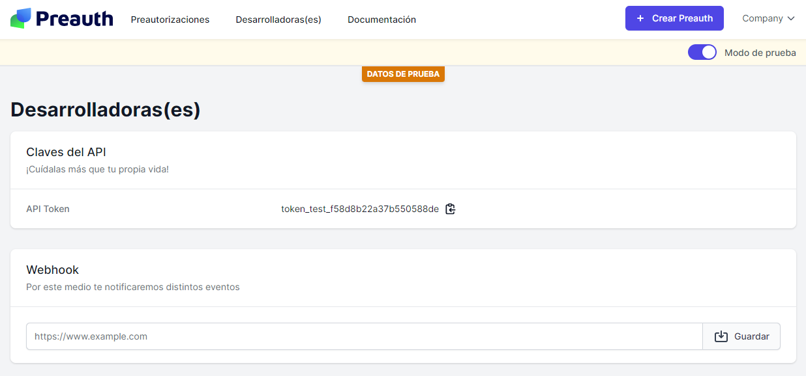

# Notificaciones/Webhooks


Únete a nuestro [_<mark style="color:blue;">espacio de Slack</mark>_](https://join.slack.com/t/preauth-soporte/shared\_invite/zt-18pzujyy8-F6cZBsHmZ\_5OZFd16fnnWw) y te ayudaremos con tus dudas


### Configuración

En el [apartado para desarrolladores](https://dashboard.preauth.io/panel/devs) puedes configurar una URL por la cual recibir notificaciones.



Cuando tengas todo configurado para recibir notificaciones, lo que haremos es enviarte la información que corresponda a cada evento por medio de un POST a la URL especificada.

### Eventos:

#### 1 Orden desincronizada

Esto sucede cuando, por alguna razón, nos es imposible retomar una preautorización.

```javascript
{
   "type":"order.desynchronized",
   "order":{
      "id": "4085-whOdSyS2FkGmm4j9feJNeMh0SjQDgLa5xAUENBkajsfQK",
      "reference": "order_00001",
      "currency": "PEN",
      "country": "PE",
      "limit_date": "2022-10-10",
      "amount": 15000,
      "status": "desynchronized",
      "pending_amount": 15000,
      "captured_amount": 0,
      "meta": {},
      "created_at": "2021-10-15 20:31:07",
      "updated_at": "2021-10-15 20:35:28"
    }
}
```

#### 2 Orden por desincronizarse

Esto sucede cuando, por alguna razón, la tarjeta falla al verificar su estado. El comercio debe decidir si capturar la transacción autorizada o ponerse en contacto con el usuario para tomarle una nueva tarjeta.

```javascript
{
   "type":"order.liveness.fail",
   "order":{
      "id": "4085-whOdSyS2FkGmm4j9feJNeMh0SjQDgLa5xAUENBkajsfQK",
      "reference": "order_00001",
      "currency": "PEN",
      "country": "PE",
      "limit_date": "2022-10-10",
      "amount": 15000,
      "status": "in_progress",
      "pending_amount": 15000,
      "captured_amount": 0,
      "meta": {},
      "created_at": "2021-10-15 20:31:07",
      "updated_at": "2021-10-15 20:35:28"
    }
}
```

#### 3 Orden capturada

Esto sucede cuando se ha ejecutado el cobro parcial o total del monto autorizado.

```javascript
{
   "type":"order.captured",
    "order":{
      "id": "4085-whOdSyS2FkGmm4j9feJNeMh0SjQDgLa5xAUENBkajsfQK",
      "reference": "order_00001",
      "currency": "PEN",
      "country": "PE",
      "limit_date": "2022-10-10",
      "amount": 15000,
      "status": "in_progress",
      "pending_amount": 10000,
      "captured_amount": 5000,
      "meta": {},
      "created_at": "2021-10-15 20:31:07",
      "updated_at": "2021-10-15 20:35:28"
  }
}
```
