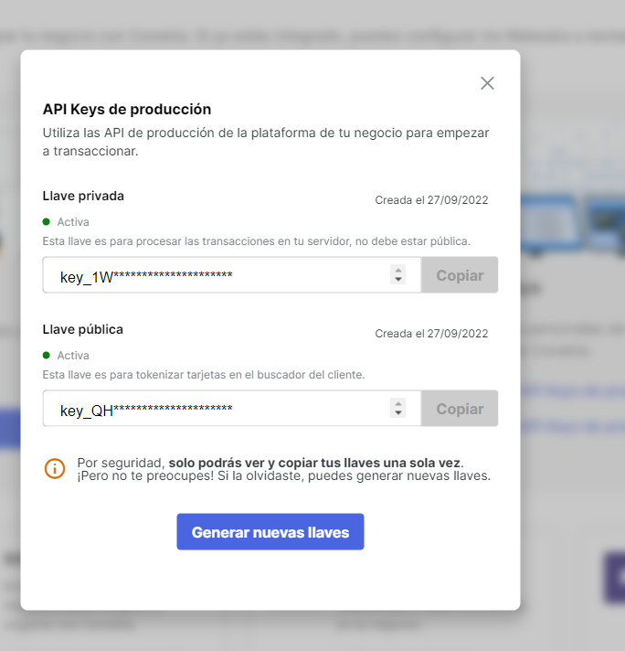

# Primeros pasos


Únete a nuestro [espacio de Slack](https://join.slack.com/t/preauth-soporte/shared\_invite/zt-18pzujyy8-F6cZBsHmZ\_5OZFd16fnnWw) y te ayudaremos con tus dudas


### 1. Registra tu compañía

Para comenzar a usar nuestro [API REST](api-rest.md) es necesario que completes nuestro [formulario de registro](https://dashboard.preauth.io/register).

### 2. Obtén tu api-token

Verifica que tengas un api-token en el [apartado para desarrolladores](https://dashboard.preauth.io/panel/devs).



### 3. Crea tu primera orden

Para crear tu primera orden haz una petición al método crear orden de nuestro [API REST](api-rest.md#crear-orden).


No te olvides de usar el api-token que obtuviste en el paso anterior y de personalizar el cuerpo de la petición.


```bash
curl -X POST  https://api.preauth.io/v1/order -H "Accept: application/json" -H "x-auth-token: token_test_a4a9f278n4c23f08e7e6" -H "content-type: application/json" -d "{\"currency\":\"PEN\",\"country\":\"PE\",\"amount\":15000,\"reference\":\"order_00001\",\"limit_date\":\"2022-10-10\"}"
```

Es importante que tengas en cuenta que el campo id de la respuesta es con el que podrás hacer las demás operaciones. Además, puedes ver que por el momento el estado de la orden es **"created"**.

* Interactuar con la orden [usando sus servicios](api-rest.md#servicios).
* Identifica [cada atributo y estado de la orden](api-rest.md#modelos).

ORDER:

```json
{
  "id": "4085-whOdSyS2FkGmm4j9feJNeMh0SjQDgLa5xAUENBkajsfQK",
  "reference": "order_00001",
  "currency": "PEN",
  "country": "PE",
  "limit_date": "2022-10-10",
  "amount": 15000,
  "status": "created",
  "pending_amount": 15000,
  "captured_amount": 0,
  "created_at": "2021-10-15 20:31:07",
  "updated_at": "2021-10-15 20:31:07"
}
```

### 4. Muestra nuestro widget

[¡Tenemos un ejemplo!](widget.md#ejemplo-completo)

#### 4.1 Carga nuestro SDK

```javascript
!function(e,t){window.PreauthObject=t,window[t]=window[t]||function(){(window[t].q=window[t].q||[]).push(arguments)};const n="script",o=document.createElement(n),c=document.getElementsByTagName(n)[0];o.async=1,o.src=e,c.parentNode.insertBefore(o,c)}("https://cdn.preauth.io/preauth.js","preauth");
```

#### 4.2 Configura el widget

```javascript
preauth("init", {
  order: "{{order_id}}",
  onSuccess() {
    //CODE
  },
  onError(e) {
    //CODE
  }
});
```

Se deben definir el \{{order\_id\}} (obtenido en el paso 3) y las funciones que se ejecutarán en caso de error o éxito.

#### 4.3 Muestra el widget

```javascript
preauth("start");
```

Este paso hace que se le muestre el formulario de **preauth** al usuario de tu web. Una vez que el usuario termine de ingresar la información de su tarjeta, el SDK invocará a la función **onSuccess** u **onError** según sea el caso. Para más información, puedes revisar la documentación de nuestro [widget](widget.md).

### 5. Verifica el estado de tu orden


No te olvides de usar tu api-token.


```bash
curl -X GET  https://api.preauth.io/v1/order/4085-whOdSyS2FkGmm4j9feJNeMh0SjQDgLa5xAUENBkajsfQK -H "Accept: application/json" -H "x-auth-token: token_test_a4a9f278n4c23f08e7e6"
```

**ORDER:**

```json
{
  "id": "4085-whOdSyS2FkGmm4j9feJNeMh0SjQDgLa5xAUENBkajsfQK",
  "reference": "order_00001",
  "currency": "PEN",
  "country": "PE",
  "limit_date": "2022-10-10",
  "amount": 15000,
  "status": "in_progress",
  "pending_amount": 15000,
  "captured_amount": 0,
  "created_at": "2021-10-15 20:31:07",
  "updated_at": "2021-10-15 20:35:28"
}
```

Si todo ha salido bien, puedes verificar que el estado cambió a **"in\_progress"** y la orden estará preautorizada hasta que se cumpla la fecha límite definida en el paso 3.
